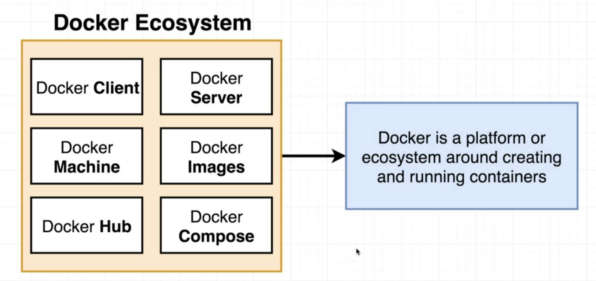
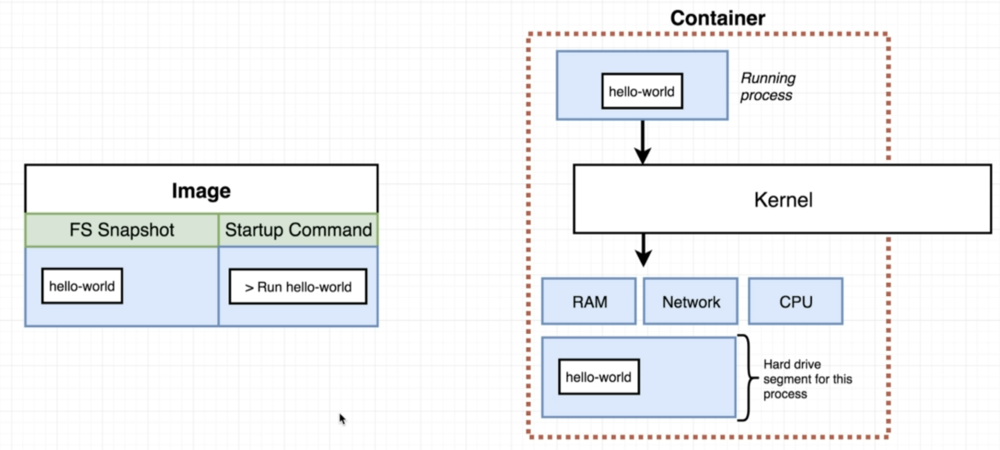
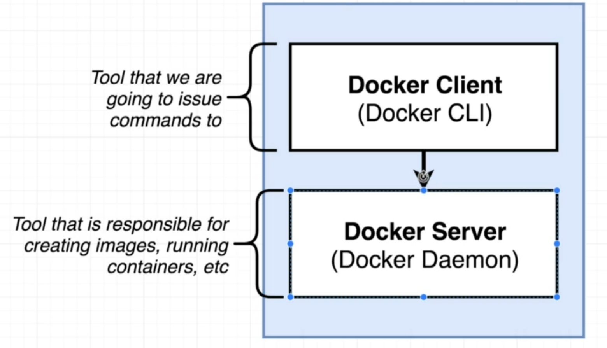
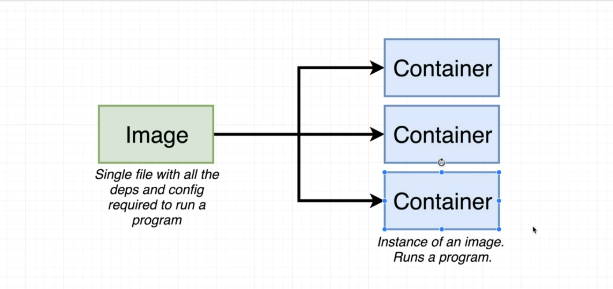
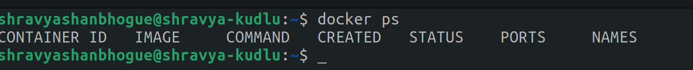
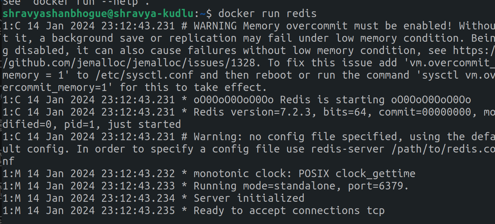
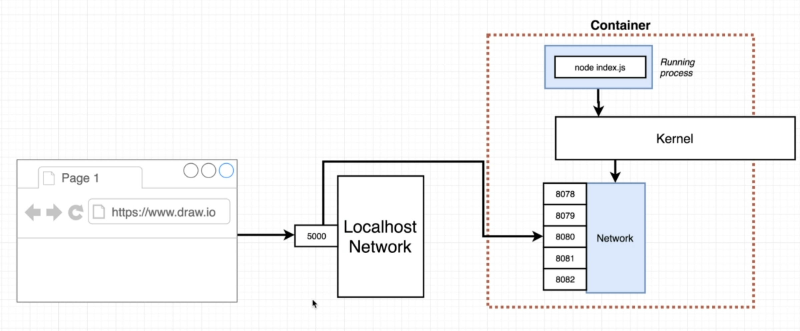

What is Docker??

Docker is a platform designed to make it easier to create, deploy, and run applications by using containers. Containers allow developers to package up an application with all parts it needs, such as libraries and dependencies, and ship it all out as one package. This ensures that the application runs reliably across different computing environments.

Key components of Docker include Docker Engine, which is the runtime that runs and manages containers, and Docker Hub, a cloud-based service for sharing and managing Docker images. 

How is Docker Running?

Some of the Docker Commands

1. docker run <image-name> <command>
This command starts and exececutes the image 
image-name ex -> hello-world, busybox etc
command -> echo Hi there, sh, ls ... etc any unix command
2. docker ps --all
This command shows all the docker container running in your machine or current server.
currently nothing on my machine

When I run redis

After

3. docker create <<image-name>

4. docker start -a <container-id> 
image-id can be obtained from docker ps command

5. docker system prune
To remove all the containers in stopped state

6. docker kill <image-id>, docker stop <container-id>
To forcefully stop a docker image

7. docker log <container-id>
To display any output log from any container which was run previosly

8. docker exec -it <container-id> <command> 
To reuse the comtainer
exec can be replaced by run
-i = Interactive Mode (-i)
-t = TTY Allocation (-t)

9. docker build . 
You can also create a Dockerfile to store all the functions and build the container like the command.

10. docker build -t @user/userpath .

11. docker run @user/userpath

12. docker run -p 8080:8080 <imagename>

:The second path is the post inside the container.

By using this I created a small protoype

